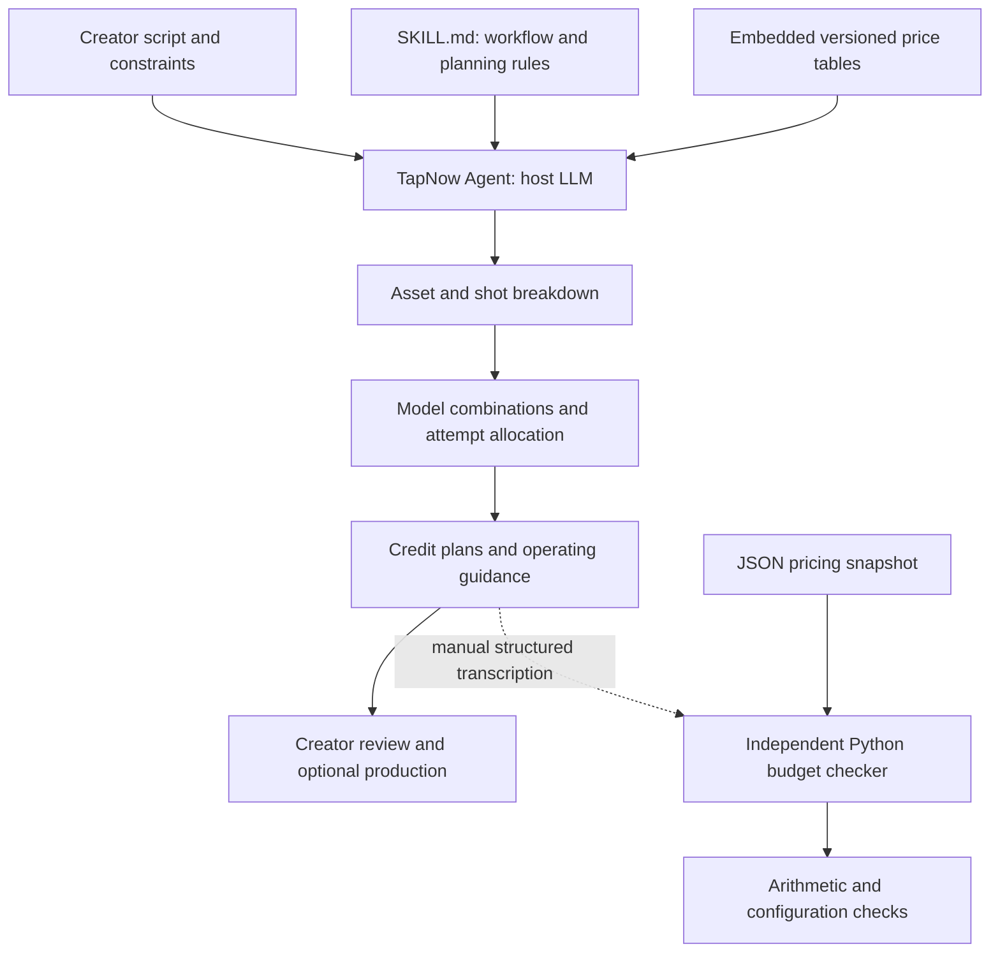

# Budget Manager Skill

**Plan AI video production, compare model combinations, and allocate generation attempts within a credit budget.**

Budget Manager is a Markdown skill for TapNow Agent. It turns a rough story, a script, or a detailed storyboard into a production breakdown and explicit Low, Medium, and High credit plans. TapNow is the MVP platform; the planning approach is designed for adaptation to other credit-based creative platforms.

The project author, Finnhao, developed this course project with AI assistance for implementation and documentation, ran the TapNow trials, and used the Skill during the Golden Touch production case. The feedback below is the author's own experience as a creator, not feedback from an independent participant. TapNow provides the Agent runtime.

> For reference only. Actual credit consumption may vary; actual charges take precedence.

## The Problem

As image and video generation models enter commercial workflows, creators increasingly use infinite-canvas tools to produce AI videos. These platforms commonly offer multiple models under a shared credit system: creators purchase credits, then spend them according to the selected model, generation mode, resolution, and video duration.

This project serves AI video creators who may have a complete storyboard or only a story draft and a target runtime. Before production, they need to understand the likely resource requirements. With a fixed budget, they must choose image and video models, output specifications, and an affordable number of attempts for each task.

Price differences are only part of the problem. A generated result may not satisfy requirements for composition, character consistency, motion, or style. Multiple attempts may be necessary. A useful plan therefore combines the cost of one generation with an explicit iteration allowance.

## What the Skill Does

The creator supplies a script, target runtime, available assets, and any budget or model constraints. The Skill:

1. Breaks the project into reusable reference assets, shot images, and video tasks.
2. Separates final-edit duration from billable generation duration.
3. Proposes Low, Medium, and High model combinations with specific parameters and credit totals.
4. Explains each plan's image and video attempt allowances and operating sequence.
5. Works backward from a fixed budget, identifying affordable evaluated combinations or explaining the shortfall.
6. Supports follow-ups about alternative models, allocating more budget to important shots, or changing the image/video allocation. Mixed task allocations must be stated and recalculated; advanced allocation quality has not been independently benchmarked.

Each fixed configuration has one scenario total, not a broad range combining unrelated models or attempt counts. Where applicable, MiniMax and Seedance are compared. The Skill does not assume Medium is the right choice for every creator.

## Quick Start in TapNow

1. Download [SKILL.md](skills/tapnow-budget-planner/SKILL.md).
2. Import the Markdown file through TapNow's Skill upload interface. The interface used in the project tests supports individual Markdown files and folders; exact controls may vary by account/version.
3. Select the imported Skill in an Agent conversation. The recorded test conversations use `/tapnow-budget-planner`; use the interface selection if that invocation is unavailable.
4. Attach or paste your script and send a planning request. No separate model API key or local Python setup is required for the Skill.

Example request:

> Plan a 20-second video from the attached story. No assets exist. Use 16:9. Show Low, Medium, and High plans with exact image and video models, parameters, generated durations, attempt allowances, and credit totals. Explain your assumptions. Do not generate media.

Follow-up examples:

> My budget is 5,000 credits and video resolution must be at least 720P. Compare affordable combinations and explain any shortfall.

> Give me at least three alternative combinations within the Medium tier. Keep its attempt allowance and compare complete costs and operating steps.

> Compare MiniMax and Seedance for this project. Distinguish recorded prices and specifications, experience-based quality recommendations, and measured comparisons.

Use [the original rough-story example](data/examples/rough-story.txt) for a new trial. This example has not yet been tested in TapNow. Existing TapNow outputs are in [data/transcripts](data/transcripts).

## Budget Semantics

| Tier | Image attempts per new asset | Video attempts per task |
|---|---:|---:|
| Low | 3 | 3 |
| Medium | 5 | 5 |
| High | 7 | 6 |

Attempts include the initial generation. They are planning allowances, not mandatory spending, measured success rates, or guarantees of usable results. Explicit creator settings override these defaults.

- **First-pass cost:** every required asset and video task is generated once.
- **Scenario budget:** unit costs multiplied by the declared attempt allowances.
- **Actual consumption:** observed charges after production, subject to scope changes and settlement.

Shared reference assets are counted once. Existing assets have no new generation charge in the current plan. Short edited shots can still require the model's minimum generated duration. Failed/refunded jobs, successful but rejected outputs, and cancellations must be distinguished.

If a budget cannot cover the evaluated first-pass requirement, the Skill must say so. If it covers one attempt but not the default iteration allowance, it must explain that distinction. Reducing attempts or changing scope is a conditional alternative, not a silent adjustment.

## Architecture



**Runtime boundary:** the tested product is the Skill running inside TapNow Agent. The Python checker is a separate offline evaluation tool; it is not integrated into the Agent. When no reliable calculator is available to the host, LLM arithmetic can be wrong. The system does not train a model, automatically generate media, monitor a live credit balance, or enforce spending limits.

## Data and Evaluation

The [data guide](data/README.md) explains price provenance, test transcripts, normalization, and the author-recorded production summary. The price snapshot is dated **2026-09-26**, not a live quotation. The Seedream promotion has a stated expiry with an unspecified timezone.

Evaluation emphasizes planning correctness and decision usefulness rather than exact final-bill prediction. Creators may revise or remove shots and stop retrying as soon as outputs are usable. Changed-scope actual spend is not directly comparable to an earlier scenario allowance.

| Evidence | Observed result | Interpretation |
|---|---|---|
| Three TapNow test transcripts | Three initial estimates and three follow-ups | Functional examples, not a large benchmark |
| Initial tier-total checks | 9 of 9 selected totals reconcile to the stated quantities and prices | Conditional arithmetic check, not proof of correct scope or recommendation quality |
| AURA fixed-budget detail table | Detail rows account for one fewer image than the summary, producing a 21-credit difference | Internal scope reconciliation issue within one response; separate from normal production changes |
| Commercial and Right Frequency recommendations | Quality judgments reflect creative experience and community perceptions described by the author | No controlled quality comparison or model-specific retry-rate measurement was conducted |
| Golden Touch production record | 555 image + 2,952 video = 3,507 credits recorded by the author | One changed-scope production case, not independently verified billing |
| Author experience | I used the model advice and attempt allowances to help control spending | One self-evaluation; no independent user study |

See [evaluation methods and results](evals/README.md) and [the documented limitations](docs/LIMITATIONS.md). The evaluation was revised from final-spend prediction error to planning correctness and usefulness. The evaluation guide explains this change; the original MAPE target remains unmeasured.

## Run the Independent Checker

Requirements: **Python 3.10 or later**. Standard library only; no packages, API keys, or paid calls are needed.

From the repository root:

```bash
python3 tools/check_budget.py data/examples/commercial-medium-plan.json
python3 -m unittest discover -s tests -v
python3 evals/run_checks.py
```

The sample returns 975 image credits, 4,320 video credits, and **5,295 scenario credits**, with a first-pass cost of 1,059. Its illustrative 6,000-credit cap leaves 705 credits for the quoted portion; it does not establish coverage of unknown fees.

To check another plan, copy the JSON example and enter explicit tasks. Use unique IDs, catalog configurations, positive integer attempt counts, and valid generated durations. Represent existing assets outside the charged task list. The checker rejects unsupported configurations rather than silently substituting prices. It validates declared task arithmetic, not the semantic correctness of a script breakdown.

## Repository Map

| Path | Purpose |
|---|---|
| `skills/tapnow-budget-planner/SKILL.md` | Standalone English Skill with embedded pricing |
| `docs/PRODUCT.md` | Persona, inputs, outputs, trade-offs and metric targets |
| `docs/LIMITATIONS.md` | Known gaps and evidence boundaries |
| `data/pricing/` | Machine-readable snapshot for offline checking |
| `data/examples/` | An original story prompt and structured checking input |
| `data/transcripts/` | Recorded Agent conversations, including observed errors |
| `data/actual-usage/` | Author-recorded production consumption |
| `tools/check_budget.py` | Deterministic validation of explicitly entered tasks |
| `tests/` | Offline boundary and invalid-input tests |
| `evals/` | Selected transcript calculations, findings and reproducible results |

## Adapting the Project

For another platform, replace prices, units, supported modes, duration limits, and platform invocation instructions. Preserve the shared asset/task concepts. Different credit units are not directly comparable. Per-clip pricing needs different calculation logic from per-second pricing. Update both the embedded Skill tables and the JSON snapshot, then rerun checks. LibTV and Updream compatibility has not been tested.

## License and Source Materials

This project is licensed under the [MIT License](LICENSE). This repository does not grant rights to third-party screenplay material or brands appearing in the examples.
